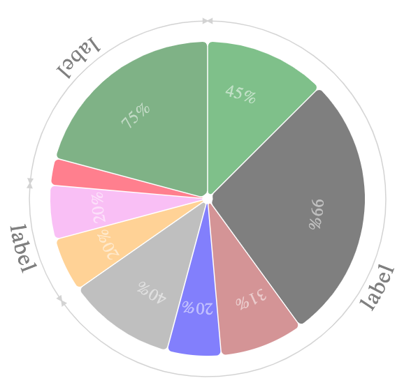

# The Dynamic Pie Chart

This library was generated with [Angular CLI](https://github.com/angular/angular-cli) version 9.1.11.

Its aims to provide a `dynamic pie chart` widget with a surrounding legend.



## How to install and use `dynamic-pie-chart` in your application ?

A simple `npm install dynamic-pie-chart` will install this library

To include this component into a container, you just have to declare this section into the HTML template.

```
<lib-dynamic-pie-chart
	[radius]=150
	[active]=true
	[legend]=legend
	[slices$]=slices$
	(selected)="sliceSelection($event)" 
	(activated)="sliceActivation($event)" 
	[typeSlices$]=typeSlices$
	[pie]=1>
</lib-dynamic-pie-chart>
```

The parameters are :

- pie : the pie identifier inside the container. 
There can be multiple pies in the same component. Each pie must have a unique pie.
- radius : the radius of the Pie in pixel.
- active : Does this pie have to be active, or not ? 
A pie is a set of slices. An active pie allows each slice to be activated, or selected, by the mouse cursor.
- legend : `true` or `false`. _Does this pie need a legend ?_ 
In this current release (1.0.0), the legend is the circle surrounding the pie.

## Input and output parameters of the widget ?


